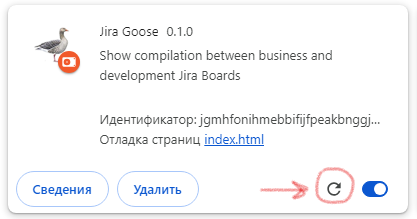

# Jira Goose

Это плагин для Google Chrome, чтобы смотреть связь доски потока бизнес целей и задач разработки в Atlassian Jira.

Плагин показывает связь эпиков с задачами бизнеса.
А так же связь задач разработки с задачами бизнеса, через один выбранный тип связи (link).

Запускайте плагин на своей **бизнес** доске.
В настройках надо выбрать тип связи, идентификатор доски разработки и
привязки колонок разных досок друг к другу.

Чтобы поменять привязки, кликните на любой из колонок и после этого кликните на колонке другого потока,
чтобы связать их.
Например, можно кликнуть на колонке "Готово" доски бизнеса, а потом на колонке "Готово" доски разработки.
В итоге эти колонки будут отображаться в одном столбце.
Если бизнес колонка включает в себя несколько колонок разработки, то связывать надо первую колонку разработки.

## Установка

### Установка из архива

Установка из архива не потребует настройки git.
Но для обновления архивы придётся скачивать руками.

Скачайте архив со страницы https://github.com/tsergey-tm/jira-goose-dist, в разделе Code -> Download ZIP.

У вас должен быть установлен git или любой его клиент. Для Windows можно использовать https://tortoisegit.org/


Распаковываете архив в каталог, где будете держать плагин.

Продолжение в [установка плагина](#установка-плагина).

### Установка с помощью git

Переходим в каталог, где будете держать плагин.
Там выполняете

```bash
git clone https://github.com/tsergey-tm/jira-goose-dist.git
``` 

Или через клиента получаете файлы из https://github.com/tsergey-tm/jira-goose-dist.git

### Установка плагина

Заходим в хроме в [chrome://extensions/](chrome://extensions/).

Там включаем режим разработчика:


Нажимаем "Загрузить распакованное расширение" и указываем каталог jira-goose-dist.

## Обновление

### Обновление из zip

Снова качаете архив и распаковываете в то же самое место.

### Обновление из git

Для обновления надо перейти в каталог jira-goose-dist
и выполнить команду pull в клиенте

```bash
git pull
```

### Обновление плагина

После этого заходим в хроме в [chrome://extensions/](chrome://extensions/)
и на плагине Jira Kanban Assistant нажимаем кнопку обновления:



## Запуск плагина

Перейдите на вашу доску и в списке плагинов нажмите на иконку .
Если доска будет опознана плагином, то в выпадающем окне появится кнопка,
чтобы открыть окно со статистикой.

